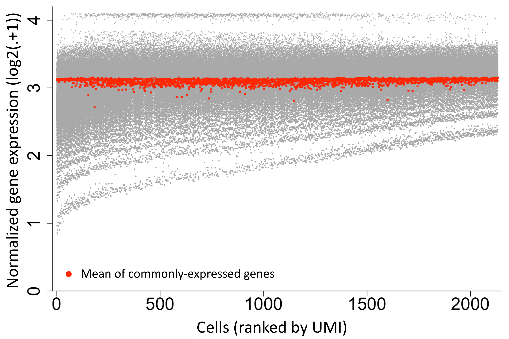
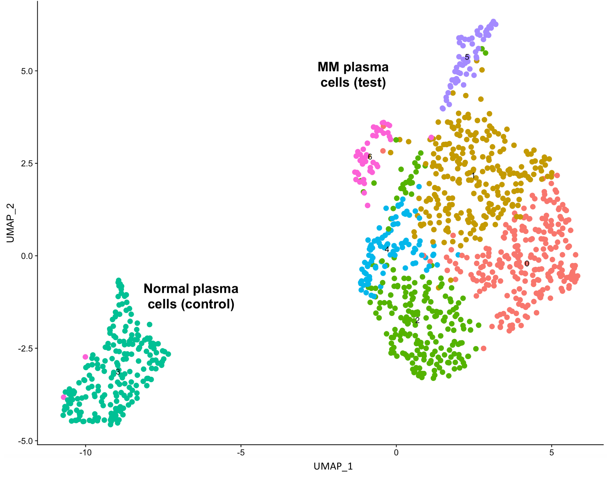
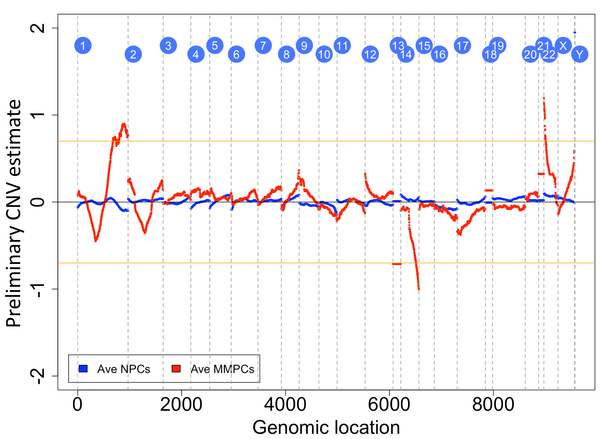
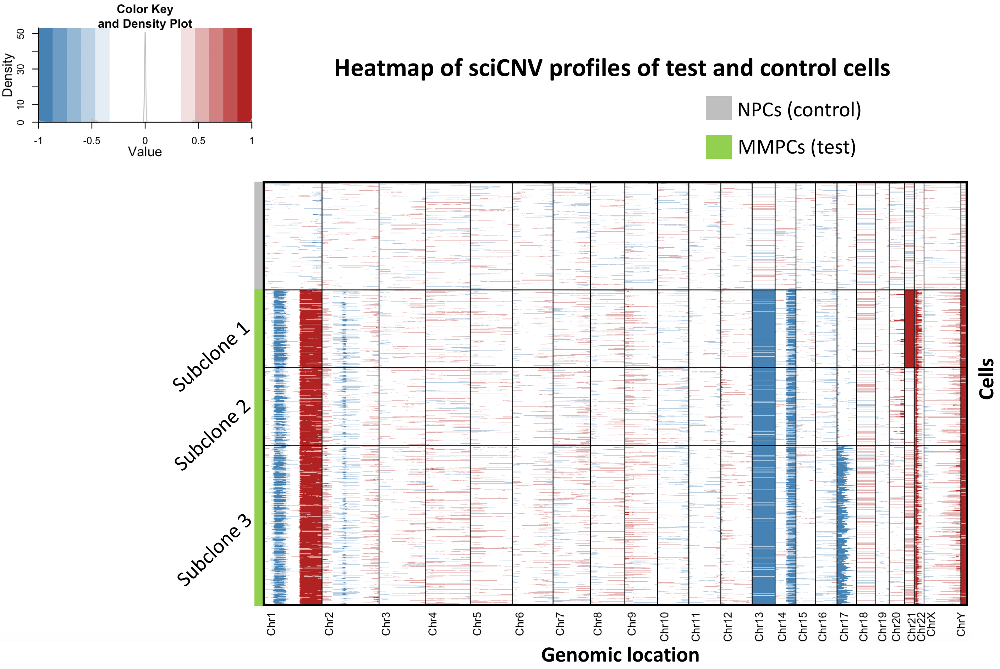

# README FILE 

## This file provides an overview of the Tiedemann Lab scRNA-seq analysis pipeline that includes: 
- scRNA-seq RTAM data normalization
- Single-cell Inferred Copy Number Variation (sciCNV)
- Quality control (QC) 
- visualization of results


## Reference

_Ali Madipour-Shirayeh, Natalie Erdmann, Chungyee Leung-Hagesteijn, Paola Neri, Ines Tagoug, Rodger E. Tiedemann, **Dissecting the effects of DNA copy number variations on transcriptional programs at single-cell resolution**, Submitted_


## Summary

Chromosome copy number variations (CNVs) are a near-universal feature of cancer however their specific effects on cellular function are poorly understood. Single-cell RNA sequencing (scRNA-seq) can reveal cellular gene expression however cannot directly link this to CNVs. Here we report scRNA-seq normalization methods (RTAM1 and RTAM2) that improve gene expression alignment between cells, increasing the sensitivity of scRNA-seq for CNV detection. We also report sciCNV, a tool for inferring CNVs from scRNA-seq. Together, these tools enable dual profiling of DNA and RNA in single cells. We apply these techniques to multiple myeloma and examine the cellular effects of pervasive cancer CNVs +8q and +1q. As expected, cells with +8q23-24 upregulate MYC-target genes, mRNA processing and protein synthesis; but also upregulate DEPTOR and have smaller transcriptomes. Cells with +1q21-44 reconfigure translation and unexpectedly suppress unfolded protein stress whilst increasing proliferation, oxidative phosphorylation and MCL1. Using scRNA-seq we reconstruct the effects of cancer CNVs on cellular programs.


###############################################


## Introduction

## 1.RTAM Normalization
Single-cell RNA-seq enables gene expression comparisons between cells. However, the accuracy of such comparisons depends critically upon data normalization. As the best methods for normalizing single-cell transcriptomes remain controversial we developed RTAM-1 and -2. The RTAM normalization approach originates from a consideration of the strengths and weaknesses of scRNA-seq. Whereas lowly expressed genes are detected within single cells with low resolution (due to integer transcript counts) and show significant stochastic variation, highly expressed genes are robustly detected and show finer quantisation of variation relative to intensity. RTAM thus utilizes highly-expressed genes, whose expression is resolved with greater accuracy, to align cellular transcriptomes. Genes are ranked by expression in each cell and the summed intensities of the top-ranked genes is standardized in log-space using cell-specific non-linear differential adjustments of gene expression determined either by gene expression rank (RTAM1) or by gene expression intensity (RTAM2). The rationale and derivation of the underlying mathematics is described in the supplemental data file associated with the reference manuscript.

## 2. sciCNV
To optimize DNA copy number estimates from gene expression, and to mitigate against data sparsity in single cells, we developed a two-pronged approach, called sciCNV (described in the supplemental data file associated with the reference manuscript). Briefly, RTAM-normalized gene expression data from single cells is aligned with matched gene expression data from control cells of a similar lineage to develop expression disparity scores, which are averaged across genomic regions in a moving window. Gene expression in the control cells is derived from scRNA-seq and is averaged; as a result the expression of each gene is weighted according to the probability of detection/non-detection by scRNA-seq amongst control cells, providing a balanced comparison with single test cell data, where signal dropout is prominent for many genes. The influence of stoichastic noise and detection drop out is minimized when multiple genes are compared. In the second method, the expression disparity values are exchanged for binary values, which are then summed cumulatively as a function of genomic location; the gradient of this function yields a second estimate of CNV that is sensitive to small concordant expression variations in contiguous genes and that is insensitive to large single-gene variations. The CNV estimates of the two methods are combined by their geometric mean. 

## Overview of the sciCNV Pipeline
The pipeline includes the following steps:

* [Data organization and quality control](#Data-organization-and-quality-control)
   * [Raw data](#Raw-data)
   * [Quality control](#Quality-control)
   * [Cell ranking by transcript count (nUMI)](#Cell-ranking-by-transcript-count-(nUMI))
* [RTAM1 and RTAM2 normalization](#RTAM1-and-RTAM2-normalization)
    * [Plotting transcript counts per gene per cell](#Plotting-transcript-counts-per-gene-per-cell)
    * [QC of normalized data](#QC-of-normalized-data)
* [Clustering to cell phenotypes](#clustering-to-cell-phenotypes)
* [Single cell inferred CNV (sciCNV) analysis from scRNA-seq data](#Single-cell-inferred-CNV-(sciCNV)-analysis-from-scRNA-seq-data)
* [Tumor clone CNV scores](#Tumor-clone-CNV-scores)
* [Heatmap of sciCNV profiles of cells](#Heatmap-of-sciCNV-profiles-of-cells)
    * [Detecting subclones](#detecting-subclones)

***
# Data organization and quality control

In this section, the raw data (representing unique transcript counts per gene per cell) is read and organized. Data from poor QC cells (identified by high mitochondrial RNA content relative to nuclear/cytosolic RNA) is excluded. 

## Raw data

The raw data, consisting of a matrix of unique transcript counts per gene per cell with gene symbols as features and cell identitifiers (e.g. barcodes) as column-names, is read.

```
raw.data1 <- read.table("./Dataset/Sample_100_CPCs__with__100_NPCs.txt", sep = '\t',header = TRUE)  
raw.data2 <- raw.data1[ , -1]
rownames(raw.data2) <- raw.data1[ , 1]
W <- ncol(raw.data2)
Col_Sum <- t(as.numeric(colSums(raw.data2)))
```


## Quality control 

### Total transcript count and mitochondrial transcript count per cell

The total number of transcripts with unique molecular identifiers (nUMIs) per cell is calculated, together with the fraction of transcripts from mitochondrial genes.

```
nUMI <- t(as.numeric(colSums(raw.data2)))
colnames(nUMI) <- colnames(raw.data2)

mito.genes <-  read.table("Sample_100_CPCs___Mitochondrial.txt", sep = '\t',header = TRUE)
mito.genes <- as.matrix(mito.genes[,-1])
percent.mito.G <- t(as.matrix(colSums(mito.genes)))/ ( Col_Sum[1:No.test] + colSums(mito.genes))

nGene1 <- matrix(0, ncol = ncol(raw.data2) , nrow = 1)
nonzero <- function(x){ sum(x != 0) }

nGene1 <- lapply( 1:ncol(raw.data2), function(i){ nonzero(raw.data2[, i])} ) 
nGene1 <- t(as.numeric(nGene1))
colnames(nGene1) <- colnames(raw.data2)
```

***
Now the scRNAseq data object is read.

```
MMS <- CreateSeuratObject(counts = raw.data2, project = "Sample1")
```


### Damaged or non viable cells

Damaged, non viable or partial cells can be identified by their high content of mitochondrial transcripts relative to other mRNA or by their low expression of genes. In our usage, cells were excluded if the total transcript count from 13 mitochondrial genes represented >5% of total cellular transcripts or if the mitochondrial gene transcript count for the cell was > 3 median absolute deviations (MAD) from the median for all cells, however other thresholds may be appropriate according to the context. In a later step, partial or non viable cells with less than a threshold number (e.g. 250) of detectable genes are also excluded.


```
damaged_cells <- Mito_umi_gn(mat = MMS, 
                             percent.mito.G = percent.mito.G,
                             nUMI = nUMI,
                             nGene = nGene1,
                             No.test = No.test,
                             drop.mads = 3 )
```

***
###  Exclusion of poor quality cells with excess mitochondrial transcripts


```
if( length(damaged_cells) > 0 ){
Outliers <- damaged_cells
raw.data <- raw.data2[, - Outliers]
nUMI <- t(as.matrix(nUMI))[, - Outliers]
} else{
  raw.data <- raw.data2
}
rownames(raw.data) <- raw.data1[ , 1]
colnames(nUMI) <- colnames(raw.data)
dim(raw.data)
```

## Cell ranking by transcript count (nUMI)

To identify any effects (biases) in normalization related to cell size/ sequence depth, cells are sorted according to their total transcript counts (nUMI) from largest to smallest nUMI.

```
raw.data <- raw.data2[, c(colnames(sort(as.data.frame(nUMI)[1:No.test], decreasing=TRUE)),
                        colnames(sort(as.data.frame(nUMI)[(No.test+1):ncol(raw.data)], decreasing=TRUE))),
                        drop=FALSE]
rownames(raw.data) <- rownames(raw.data2) 
```

***
# RTAM1 and RTAM2 normalization

RTAM1 or RTAM2 normalization procedures are applied. The number of highly expressed genes used for the alignment of transctiptomes can be specified. More information can be found in the reference supplemental materials and in the RTAM script.

```
norm.data <- RTAM_normalization(mat = raw.data,            
                                method = "RTAM2",      
                                Min_nGn  = 250,       
                                Optimizing = FALSE)
rownames(norm.data) <- rownames(raw.data2) 
colnames(norm.data) <- colnames(raw.data)
```

## Plotting transcript counts per gene per cell

To compare the normalized transcriptomes, the normalized expression of each gene in each cell is plotted. As transcript counts are integers, the expression values for many lowly expressed genes (with n=1,2,3 .. transcripts) are identical and align on tiers. Each tier may represent multiple genes in any single cell. 

```
graphics.off()
plot.new()
par(mar=c(5,5,4,2)+1,mgp=c(3,1,0))
par(xaxs="i", yaxs="i") 
par(bty="l")
plot(matrix(1,ncol=1,nrow=nrow(as.matrix(norm.data[,1][norm.data[,1]>0]))), 
     log2(as.matrix(norm.data[,1][norm.data[,1]>0]) +1  ), pch=16, cex=0.3, 
     col="darkgray" ,
     xlim=c(-ncol(norm.data)*.1, ncol(norm.data)*1.1),
     ylim=c(0,  4.2), xlab = "Cells (ranked by UMI)",
     ylab = expression("Expressions ("*Log[2]*"(.+1 ))"), 
     cex.lab = 2, cex.axis = 2, cex.main=2)
for(i in 2:ncol(norm.data)){
  par(new=TRUE)
  points(  matrix(i,ncol=1,nrow=nrow(as.matrix(norm.data[,i][norm.data[,i]>0]))), 
           log2(as.matrix(norm.data[,i][norm.data[,i]>0]) +1  ), pch=16, cex=0.3, 
           col="darkgray")
}
title( paste("Sample1, RTAM2-normalization, cutoff ", 250," nGene ",250,sep=""), 
       col.main = "brown", cex.main = 2)
```     

## QC of normalized data

To assess the alignment of the normalized cellular transcriptomes, the mean or median expression in each cell of large sets of uniquitous genes is examined, including: 

(1) a curated set of housekeeping genes (HKG), or 
(2) the set of all commonly-expressed genes (detected in >95% of the cells studied)

Whilst the expression of any individual gene is expected to vary between cells for both biological and technical reasons, the average expression per cell of a large set of ubiquitous genes should be similar, particularly amongst cells of the same lineage. 

### The average expression of commonly-expressed genes (with detectable expression in >95% cells in the dataset)

```
Sqnce <- seq(1,ncol(norm.data),1)
Common.mat <-   as.matrix(norm.data[which(rowSums(norm.data[,Sqnce ] != 0) > 0.95*ncol(norm.data) ), ] )

library(robustbase)
COLMED <- log2(colMeans(as.matrix(Common.mat[Common.mat>0])) +1)
COLMED <- t(as.matrix(COLMED) )

for(j in 1:ncol(norm.data)){
  par( new=TRUE)
  points(matrix(j,ncol=1,nrow=1),
  log2(mean(as.matrix(Common.mat[,j][Common.mat[,j]>0])) + 1 ) ,
  axis = FALSE , col="red" , pch=15, cex =0.5      
  )
} 

legend(0,0.75,bty="n",pch=16,col=c("red",NA), cex=1.5,
       legend=paste("Mean of 95% commonly expressed genes")) 
```




### The average expression of housekeeping genes

```
Houskeeping_gene_list <- read.table( "./Dataset/HouseKeepingGenes.txt", sep = '\t',header = TRUE)
HK_mat  <- norm.data[which(raw.data1[ , 1]%in% t(as.matrix(Houskeeping_gene_list))), ]
HK_mat <- as.matrix(HK_mat)
for(k in 1:ncol(HK_mat)){
  Mean_HK_mat[1, k] <- as.numeric(mean(HK_mat[,k][HK_mat[,k]>0]))
  }

par( new=TRUE)
points(log2(Mean_HK_mat[1,] +1 ), col="blue" , pch=15, cex =0.5 )
legend(0,0.5,bty="n",pch=16,col=c("blue",NA), cex=1.5, legend=paste("Mean of houskeeping gene expressions"))
```

#


***
# Clustering to cell phenotypes

Cells are clustered into {lineages/phenotypes/subclones} by dimensionality reduction of normalized transcriptomes, using principle component analysis or tSNE/UMAP methods. As this clustering is driven by differential gene expression, non informative genes which are not expressed are excluded:

```
train1 <- as.matrix(norm.data)
rownames(train1) <- rownames(Scaled_Normalized_log)
colnames(train1) <- colnames(Scaled_Normalized_log)

train <- as.matrix(train1[which(rowSums(train1 != 0) >= 1  ), ] )

# Updating list of cells in nUMI and nGene for lateron analyses
nUMI <- as.matrix(nUMI[1 , colnames(train)])
nGene <- as.matrix(nGene[1 , colnames(train)])
```

tSNE/UMAP clustering of normalized data is performed on a matrix of single cells (MSC), generated as a Seurat object. 

```
MSC <- CreateSeuratObject(counts = train, project = "sample1")
MSC <- FindVariableFeatures(object = MSC)
all.genes <- rownames(MSC)
MSC <- ScaleData(MSC, features = all.genes)
MSC <- RunPCA(object = MSC, do.print = TRUE, 
              pcs.print = 1:10, genes.print = 10)
MSC <- FindNeighbors(object = MSC)
MSC <- FindClusters(object = MSC)

## Running tSNE
MSC <- RunTSNE(object = MSC, 
               reduction.type = "pca",   #  "cca.aligned",
               dims.use = 1:5, do.fast = TRUE)
DimPlot(object = MSC,reduction = "tsne", pt.size = 3, 
        label = TRUE, label.size = 4)

## Running UMAP
MSC <- RunUMAP(MSC, dims = 1:10)
DimPlot(MSC, reduction = "umap", 
             pt.size = 3, 
             label = TRUE, 
             label.size = 4)                        
```



***
# Single cell inferred CNV (sciCNV) analysis from scRNA-seq data

The sciCNV pipeline is applied to a dataset comprising test and control cells to infer the genomic CNV profile of each cell. For full information on the approach, please refer to the reference supplemental materials.

(1) input the normalized matrix of test and control cells which is called _norm.tst.ctrl_ matrix,

```
ctrl.index <- seq( No.test + 1, ncol(norm.data), 1)   # No of controcl cells
tst.index <- seq(1, No.test , 1)                      # No of test cells
```

(2) The sciCNV function is used to generate preliminary single cell inferred CNV curves for cells in the matrix. 

Two variables can be used to enhance the quality of the output according to the input data.

The variable sharpness is used to define the sharpness (resolution) of the CNV analysis. The default value is 1.0; this can be adjusted (e.g. in the range 0.6-1.4) according to the sample data sparsity: higher values permit sharper detection of small CNV but require greater data density; lower values help offset sparse data.

Baseline adjustment: For the default sciCNV analysis an assumption is made that chromosome gains and losses are approximately balanced and that the median copy number result for genes in each cell is zero. When these assumptions are substantially invalid (for example, as in the case of a cell with a large number of trisomies with substantial net genomic gain), the sciCNV analysis can be re-run using a baseline correction to correct the CNV zero set point and improve CNV detection. 'baseline' refers to a fraction representing the approximate net genomic change, where zero reflects balanced losses and gains, and 1 represents copy number gain of the entire genome. A positive fraction indicated net gain and a negative fraction indicates net genomic loss. Please refer to the reference supplemental materials.

```
CNV.data <- sciCNV(norm.mat = norm.data, 
                   No.test = No.test, 
                   sharpness  = 1, 
                   baseline_adj  = FALSE,  
                   baseline = 0)
```

**Note:** _For larger datasets we recommend running this part of the algorithm on cluster (i.e. run a .bash) due 
to the calculation cost required to generate sciCNV-curves for each cell_.




(3) The preliminary sciCNV profile matrix is scaled such that single (1) copy number gain/losses yield values of +1/-1. 


```
CNV.data.scaled <- Scaling_CNV( CNV.data, n.TestCells = No.test, scaling.factor = 0.4)
M_NF <- CNV.data.scaled
```


(4) As single cell CNV should be integers, preliminary sciCNV values falling below a noise threshold (0.4 or a user-specified threshold) were set to zero. We define M_NF as the noise-free data matrix, which is attached to the average expression of test cells.

```
noise.thr = 0.4   # Noise threshold
for(w in 1:ncol(M_NF) ){
  for(j in 1:nrow(M_NF)){
    if( (M_NF[j,w] > -noise.thr) && (M_NF[j,w] < noise.thr)  ){
      M_NF[j,w] <- 0
    }
  }
}
M_NF <- as.matrix(M_NF)
```
(5) As the preliminary sciCNV values are multiples of two CNV methods, the square root of the preliminary values is taken, to produce the geometric mean of the two methods.


```
for(w in 1:ncol(M_NF)){
  for(j in 1:nrow(M_NF)){
    if (M_NF[j,w] > 0){
      M_NF[j,w]<- sqrt( as.numeric(M_NF[j,w]))
    } else if (M_NF[j,w] < 0){
      M_NF[j,w]<- -sqrt( -as.numeric(M_NF[j,w]))
    }
  }
}

rownames(M_NF) <- rownames(CNV.data.scaled)
colnames(M_NF) <- c(colnames(CNV.data.scaled)[-length(colnames(CNV.data.scaled))], "AveTest")
```

(6) In order to plot sciCNV profiles by genomic location, rather than by gene rank, genomic locations are determined.

```
Gen.Loc <- read.table("./Dataset/10XGenomics_gen_pos_GRCh38-1.2.0.txt", sep = '\t', header=TRUE)
Specific_genes <- which( as.matrix(Gen.Loc)[, 1]   %in% rownames(CNV.scaled))
Assoc.Chr <-  as.matrix(Gen.Loc[Specific_genes, 2])
Assoc.Chr <-  apply(Assoc.Chr, 2, as.numeric)
```
(7) The sciCNV M_NF matrix is finalized by including gene names, chromosome and genomic locations.

```
M_NF1 <- cbind(as.matrix(Gen.Loc[Specific_genes, 1]), 
               as.matrix(Gen.Loc[Specific_genes, 2]), 
               M_NF)
colnames(M_NF1) <- c("Genes", "Chromosomes", colnames(norm.data), "Ave test")
```

(8) The average sciCNV profile of test cells can be reviewed:

```
M_NF2 <- as.matrix(M_NF1)
M_NF3 <- as.matrix(M_NF2[ , ncol(M_NF2)] )
rownames(M_NF3) <- as.matrix(M_NF2[ , 1] )
#pdf( paste("AveiCNVcurve_testVScontrol_scaling factor",scaling.factor,"_Noise threshold:",noise.thr,".pdf", sep=""),
#     width = 6, height = 4, paper = 'special')

Sketch_AveCNV( Ave.mat = M_NF[, ncol(M_NF)], Gen.loc = Gen.Loc  )
```


***
# Tumor clone CNV scores

sciCNV can be used to identify cancer cells, distinguishing these from normal cells on the basis of their CNV profile. The sciCNV profile of single cells is assessed against the average sciCNV profile of tumor cells. 

```
TotScore <- CNV_score( M_nf = M_NF )
```

Tumor CNV scores for single cells are sketched, showing the segregation of normal plasma cells (NPC) and tumor plasma cells by their CNV scores:

```
TotScoreSort0 <- sort(TotScore[1,1:No.test])
TotScoreSortNPC <- sort(TotScore[1,(No.test+1):ncol(TotScore)])
colors <- c( "royalblue1","brown1")
Labels <- c("NPCs","CLS0")
names <- as.matrix(c(rep(Labels[1], length(TotScoreSortNPC)), rep(Labels[2],length(TotScoreSort0) )) )
value <- c(as.matrix(TotScoreSortNPC), as.matrix(TotScoreSort0))
data=data.frame(names,value)
data$factor <- factor(data$names, levels=Labels)
##
graphics.off()
plot.new()
par(mar=c(5,5,4,2)+1,mgp=c(3,1,0))
par(bty="l")
boxplot(data$value ~ data$factor , col=alpha(colors,0.6),
        ylim=c(min(TotScore)-1,max(TotScore)+1), 
        cex.lab = 2, cex.axis = 2, cex.main=2,
        xlab = "Type of individuals"
        , ylab = "CNV-score",
        bty='l', boxcol="gray" ,
        outpch=16, outcex=1)
title("CNV-score of individuals", col.main = "brown", cex.main = 2.5)
##
mylevels<-levels(data$factor)
levelProportions<-summary(data$factor)/nrow(data)

for(i in 1:length(mylevels)){
  thislevel<-mylevels[i]
  thisvalues<-data[data$factor==thislevel, "value"]
  myjitter<-jitter(rep(i, length(thisvalues)), amount=levelProportions[i]/2)
  points(myjitter, thisvalues, pch=20, cex=2, xaxt = "n",yaxt = "n",col=alpha(colors[i], 0.6) )  
}
```


***
# Heatmap of sciCNV profiles of cells

The results of sciCNV profiling of multiple cells can be reviewed in a heatmap. The _heatmap3_ function 
is utilized. Single cell sciCNV values (colour-scale) for mutliple cells (y axis) are plotted either by: 
1) genomic rank-order of genes from which the CVS are derived (using _CNV_htmp_glist_ function) or by
2) the physical genomic location of the genes (manipulating  _CNV_htmp_gloc_ function).

Option 1 has the advantage that the heatmap provides an image in which pixels map directly to the underlying (gene) data density; regions with few genes are under-represented (drawn as short stretches) while regions with many genes are over-represented (long stretches). Option 2 stretches (interpolates) and/or condenses the sciCNV profiles to map onto a physical genome, and thus provides a CNV picture that more closely resembles the physical chromatin structure. 

```
CNV.mat <- t( M_NF[, -ncol(M_NF)])   
rownames(CNV.mat) <- colnames(M_NF[, -ncol(M_NF)])
colnames(CNV.mat) <- rownames(CNV.data)
```


```
## against list of genes
break.glist <- rep(0, 24)
break.glist <- heatmap_break_glist(CNV.mat2 = CNV.matrix )

CNV_htmp_glist( CNV.mat2 = CNV.matrix,
                Gen.Loc = Gen.Loc,
                clustering = FALSE,        
                sorting = TRUE,        
                CNVscore = TotScore,
                break.glist = break.glist,
                No.test = No.test )
```

```

## against actual hgenomic locations
break.gloc <- rep(0, 24)
break.gloc <- heatmap_break_gloc()

CNV_htmp_gloc( CNV.mat2 = CNV.matrix,
               Gen.Loc = Gen.Loc,
               clustering = FALSE,
               sorting = TRUE,        
               CNVscore = TotScore,
               break.gloc = break.gloc,
               No.test = No.test )
```


## Detecting subclones

CNV profiles can be used to separate cells into subclones, as shown in below figure. CNV-based clustering of cells may be a more effective method for isolating CNV subclones than gene-expression based clustering, as the later can be confounded by cellular functions such as prolfieration. For more details, please see the reference and supplemental materials. 


