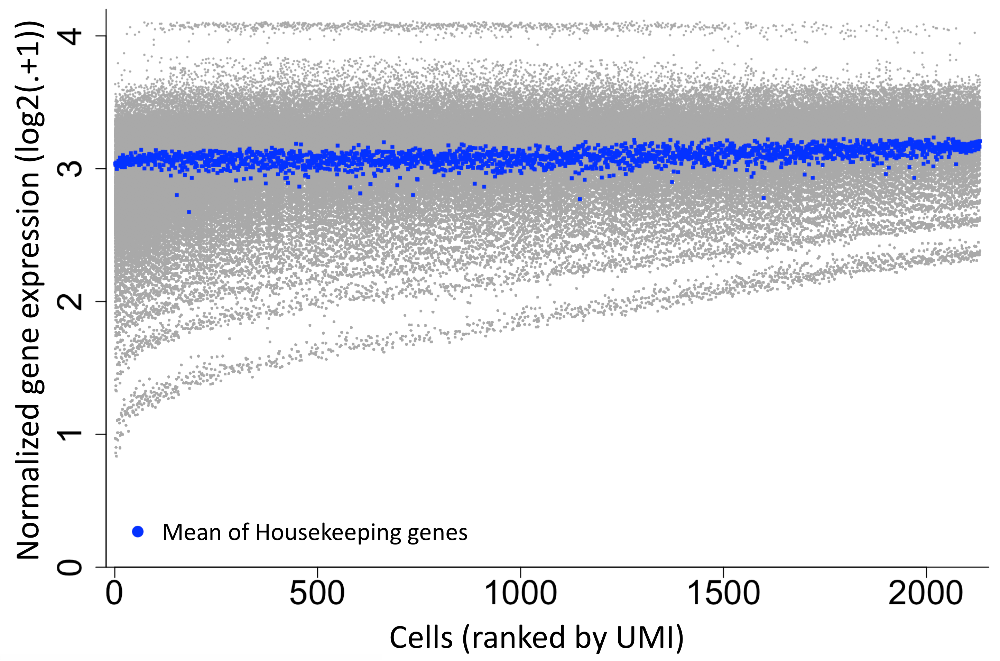
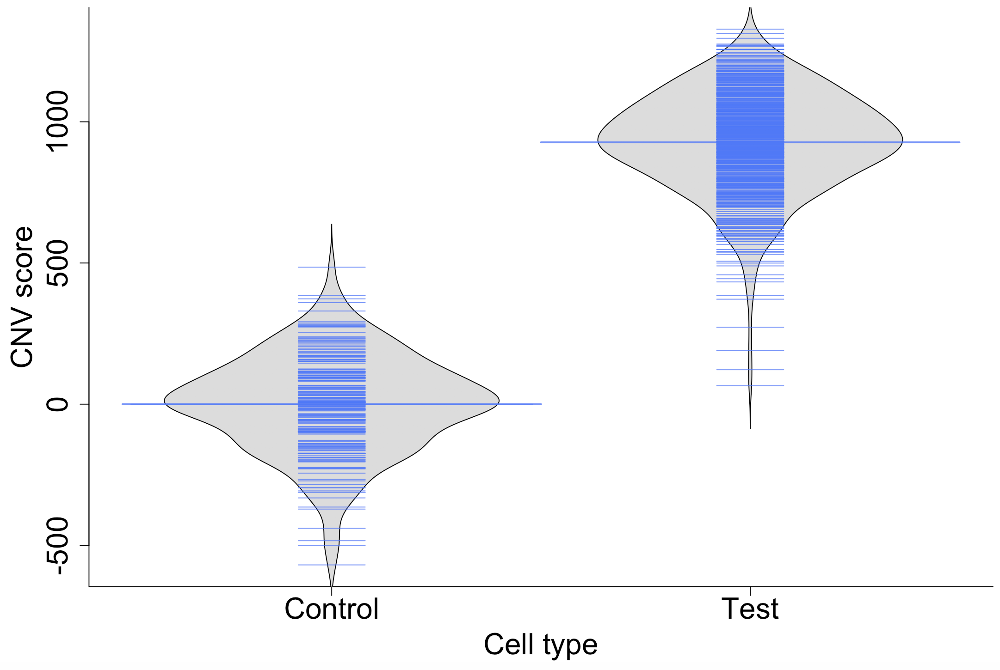
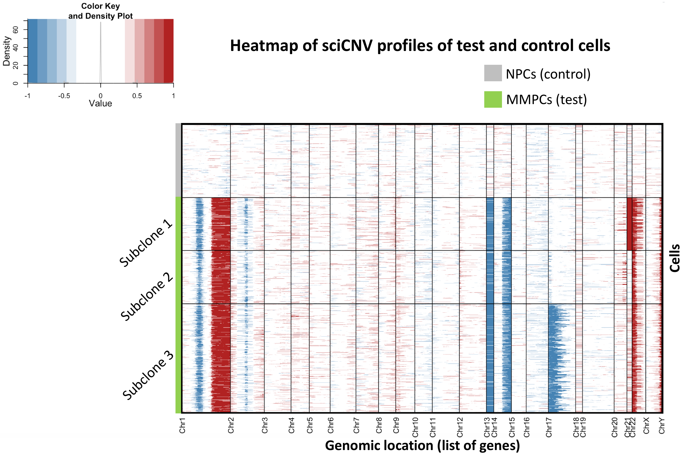

# A Short Explanation to sciCNV Pipeline
## Introduction
An important challenge in single-cell study using RNA-seqs and specifically calling 
copy number variations is to provide an unbiased (normalized) dataset which is bale to 
reflect real biological interface and actual functionality of genes across entire 
genome against a negative control. This can be even more challenging if one wants to 
merge two datasets (e.g. merging test sample and control sample).

Here, we introduce a new bioinformatics tool developed to overcome these 
problems and to provide an accurate inferred copy-number-alteration analysis to 
study the evolutionary pathogenesis of a targeted disease/disorder. Our analysis 
can be widely applied to any malignancy/abnormality and in any 
context of intra-tumoral/malignant/infectious heterogeneous systems.

Single-cell inferred Copy Number Variation (sciCNV) pipeline is a novel 
strategy that we developed to likely answer all these challenges. Our pipeline 
includes the following steps:

* [Reading data and quality control](#Reading-data-and-quality-control)
   * [Reading raw data with a list of genes on the first column](#Reading-raw-data-with-a-list-of-genes-on-the-first-column)
   * [Quality Control (QC): Eliminating damahged cells](#Quality-Control-(-QC-)-:-Eliminating-damahged-cells )
* [RTAM1/RTAM2 Normalization](#RTAM1/RTAM2-Normalization)
    * [RTAM1/2 normalziation](#RTAM1/2)
    * [Justification of normalized data](#justification-of-normalized-data)
* [Clustering to cell-types](#clustering-to-celltypes)
* [iCNV Analysis from RNA-seq data](#infered-CNV-analysis)
    * [generating infered-CNV curves for (test and/or control) cells ](##sciCNV-on-normalized-data)
    * [Scaling and Filtering noise of the iCNV curves ](##Scaling_Noise_Filtering)
    * [Sketching the average MMPCs iCNV-curve after correction](##Sketching_ave_iCNV)
* [Clone CNV-score](#Clone-CNV-score)
* [Heatmap of CNV-curves and detecting rare subclones](#Heatmap-of-CNV-curves-and-detecting-rare-subclones)
    * [Generating heatmap](#generating_heatmap)
    * [Detecting subclones](#deteccting_subclones)


***
# Reading data and quality control

In this section, we firstly read raw-data in which transcription values per gene is given for 
a set of single-cells. There exist at least two important provocations of removing 
1) Damaged cells 
2) Doublets (triplets, ...)

We answer to the first provocation by considering the appropriate level of 
mitochondrial gene expressions in specific organs; to be accurate the percentage 
of mitochondrial level. Answering to the second provocation is 
not easy as we firstly need to separate the population of cells (samples) to diverse 
phyno(geno)-types, as doublets (triplets,  ... ) of each type can be only 
compared to those features (such as transcription level, number of expressed genes, 
total number of UMI for each cell, ... )  that are specific to the same type.

```
library(devtools)
library(Seurat)
library(dplyr)
library(Matrix)
library(qlcMatrix)
library(devtools)
library(svd)
library(ggplot2)
library(ggridges)
library(viridis)
require(scales)
library(RColorBrewer)
library(Rtsne)
library(reticulate)
library(robustbase)
library(umap)
source_url("https://raw.githubusercontent.com/obigriffith/biostar-tutorials/master/Heatmaps/heatmap.3.R")

##
##
path.code <- "."
source(file.path(path.code, "Mito_umi_gn.R"))
source(file.path(path.code, "RTAM_normalization.R"))
source(file.path(path.code, "sciCNV.R"))
source(file.path(path.code, "Scaling_CNV.R"))
source(file.path(path.code, "CNV_score.R"))
source(file.path(path.code, "sciCNV.R"))
source(file.path(path.code, "Sketch_AveCNV.R"))
source(file.path(path.code, "CNV_htmp_glist.R"))
source(file.path(path.code, "CNV_htmp_gloc.R"))
source(file.path(path.code, "Opt_MeanSD_RTAM1.R"))
source(file.path(path.code, "Opt_MeanSD_RTAM2.R"))
source(file.path(path.code, "heatmap_break_glist.R"))
source(file.path(path.code, "heatmap_break_gloc.R"))
```

## Reading raw data with a list of genes on the first column

Starting with raw data in which gene symbols are as features and cell identities are 
as column-names, we firstly try to exclude damaged cells when the mitochondrial 
gene expressions of those cells are relatively higher than a specific (organ-dependent) 
threshold. This threshold can be changed based on the physiological situation of cells,
 e.g. when the sample is fresh or frozen and can be different in different cell-types.

```
raw.data1 <- read.table("./Sample_100_CPCs__with__100_NPCs.txt", sep = '\t',header = TRUE)  
raw.data2 <- raw.data1[ , -1]
rownames(raw.data2) <- raw.data1[ , 1]
W <- ncol(raw.data2)
Col_Sum <- t(as.numeric(colSums(raw.data2)))
```

***
## Quality Control (QC): Eliminating damahged cells 

### Reading UMI and mitochondrial gene expressions associated to the data

Inserting number of UMIs (nUMIs) and transcription values of mitochondrial genes, we 
calculate the percentage of mitochondrial levels and remove cells with a higher 
expression of mitochondrial gene in comparison to a threshold.

```
nUMI <- t(as.numeric(colSums(raw.data2)))
colnames(nUMI) <- colnames(raw.data2)

mito.genes <-  read.table("Sample_100_CPCs___Mitochondrial.txt", sep = '\t',header = TRUE)
mito.genes <- as.matrix(mito.genes[,-1])
percent.mito.G <- t(as.matrix(colSums(mito.genes)))/ ( Col_Sum[1:No.test] + colSums(mito.genes))

nGene1 <- matrix(0, ncol = ncol(raw.data2) , nrow = 1)
nonzero <- function(x){ sum(x != 0) }

nGene1 <- lapply( 1:ncol(raw.data2), function(i){ nonzero(raw.data2[, i])} ) 
nGene1 <- t(as.numeric(nGene1))
colnames(nGene1) <- colnames(raw.data2)
```


***
Now we read the 10x Genomics object and try to remove damaged cells 
across entire population.

```
MMS <- CreateSeuratObject(counts = raw.data2, project = "Sample1")
```

### Defining threshold to remove damaged cells

In case there is no tissue-specific threshold for the percentage of mitochondrial gene 
expressions, we usually consider the distribution of such percentages and assign 3 MAD 
as the threshold to exclude damaged cells.

```
damaged_cells <- Mito_umi_gn(mat = MMS, 
                             percent.mito.G = percent.mito.G,
                             nUMI = nUMI,
                             nGene = nGene1,
                             No.test = No.test,
                             drop.mads = 3 )
```

***
##  Excluding Damaged Cells


```
if( length(damaged_cells) > 0 ){
Outliers <- damaged_cells
raw.data <- raw.data2[, - Outliers]
nUMI <- t(as.matrix(nUMI))[, - Outliers]
} else{
  raw.data <- raw.data2
}
rownames(raw.data) <- raw.data1[ , 1]
colnames(nUMI) <- colnames(raw.data)
dim(raw.data)
```

##  Sorting based on nUMI per cell (from largest to smallest nUMI)
```
raw.data <- raw.data2[, c(colnames(sort(as.data.frame(nUMI)[1:No.test], decreasing=TRUE)),
                        colnames(sort(as.data.frame(nUMI)[(No.test+1):ncol(raw.data)], decreasing=TRUE))),
                        drop=FALSE]
rownames(raw.data) <- rownames(raw.data2) 
```

***
#RTAM1/RTAM2 Normalization

In the current step, we apply our novel normalization methods: RTAM1 & RTAM2, 
to normalize raw data to a balanced, rational and consistent dataset of transcription 
values.

```
norm.data <- RTAM_normalization(mat = raw.data,            
                                method = "RTAM2",      
                                Min_nGn  = 250,       
                                Optimizing = FALSE)
rownames(norm.data) <- rownames(raw.data2) 
colnames(norm.data) <- colnames(raw.data)
```

## Sketching non-zero expressions

To observe the (non-zero) expression levels of normalized data, we sketch them all in 
a unique figure.

```
graphics.off()
plot.new()
par(mar=c(5,5,4,2)+1,mgp=c(3,1,0))
par(xaxs="i", yaxs="i") 
par(bty="l")
plot(matrix(1,ncol=1,nrow=nrow(as.matrix(norm.data[,1][norm.data[,1]>0]))), 
     log2(as.matrix(norm.data[,1][norm.data[,1]>0]) +1  ), pch=16, cex=0.3, 
     col="darkgray" ,
     xlim=c(-ncol(norm.data)*.1, ncol(norm.data)*1.1),
     ylim=c(0,  4.2), xlab = "Cells (ranked by UMI)",
     ylab = expression("Expressions ("*Log[2]*"(.+1 ))"), 
     cex.lab = 2, cex.axis = 2, cex.main=2)
for(i in 2:ncol(norm.data)){
  par(new=TRUE)
  points(  matrix(i,ncol=1,nrow=nrow(as.matrix(norm.data[,i][norm.data[,i]>0]))), 
           log2(as.matrix(norm.data[,i][norm.data[,i]>0]) +1  ), pch=16, cex=0.3, 
           col="darkgray")
}
title( paste("Sample1, RTAM2-normalization, cutoff ", 250," nGene ",250,sep=""), 
       col.main = "brown", cex.main = 2)
```     

### Checking the balance of 95% commonly expressed genes

There are several existing methods to check the accuracy of normalization 
(removing/reducing batch effects). In here we consider two methods: 
1) Considering the average expression of those genes that are expressed in majority 
of cells (for instance common genes in 95% of cells) which are supposed to be almost equal across
entire population after normalization.
2) Using the average gene expression for a list of house-keeping genes (or a spike-in list of genes) 
which is assumed to remain unchanged and about equal after normalization.

```
Sqnce <- seq(1,ncol(norm.data),1)
Common.mat <-   as.matrix(norm.data[which(rowSums(norm.data[,Sqnce ] != 0) > 0.95*ncol(norm.data) ), ] )

library(robustbase)
COLMED <- log2(colMeans(as.matrix(Common.mat[Common.mat>0])) +1)
COLMED <- t(as.matrix(COLMED) )

for(j in 1:ncol(norm.data)){
  par( new=TRUE)
  points(matrix(j,ncol=1,nrow=1),
  log2(mean(as.matrix(Common.mat[,j][Common.mat[,j]>0])) + 1 ) ,
  axis = FALSE , col="red" , pch=15, cex =0.5      
  )
} 

legend(0,0.75,bty="n",pch=16,col=c("red",NA), cex=1.5,
       legend=paste("Mean of 95% commonly expressed genes")) 
```


### Checking the balance of average expression of housekeeping genes

```
Houskeeping_gene_list <- read.table( "./HouseKeepingGenes.txt", sep = '\t',header = TRUE)
HK_mat  <- norm.data[which(raw.data1[ , 1]%in% t(as.matrix(Houskeeping_gene_list))), ]
HK_mat <- as.matrix(HK_mat)
colnames(HK_mat) <- colnames(norm.data)
Mean_BB12 <- matrix(0, ncol = ncol(norm.data) , nrow = 1)
for(k in 1: (ncol(norm.data))){
Mean_HK_mat[1,k] <- as.numeric(mean(HK_mat[,k][HK_mat[,k]>0]) )
}
par( new=TRUE)
points(log2(Mean_HK_mat[1,] +1 ), col="blue" , pch=15, cex =0.5 )
legend(0,0.5,bty="n",pch=16,col=c("blue",NA), cex=1.5, legend=paste("Mean of Houskeeping gene expressions"))
```

#


***
# Clustering to cell-types

Now we cluster cells (samples) from the normalized dataset to possible cell-types applying 
dimensionality reduction, principle Component Analysis (Canonical Correlation Analysis or ...), 
tSNE/UMAP methods to detect and sketch diverse clusters.

***
##  Excluding non-expressed genes

Since differential gene expressions define diverse clusters, at this stage 
we remove those genes which do not represent any expressions across entire population.

```
train1 <- as.matrix(norm.data)
rownames(train1) <- rownames(Scaled_Normalized_log)
colnames(train1) <- colnames(Scaled_Normalized_log)

train <- as.matrix(train1[which(rowSums(train1 != 0) >= 1  ), ] )
dim(train)
```

***
##  clustering the normalized data

And then clustering normalized data to diverse phyno(geno)-types:


## Finding matrix of single cells (MSC) as a seurat object for clustering

We generate a Seurat object to run tSNE/UMAP clustering methods through this 
package.

```
MSC <- CreateSeuratObject(counts = train, project = "sample1")
MSC <- FindVariableFeatures(object = MSC)
all.genes <- rownames(MSC)
MSC <- ScaleData(MSC, features = all.genes)
MSC <- RunPCA(object = MSC, do.print = TRUE, 
              pcs.print = 1:10, genes.print = 10)
MSC <- FindNeighbors(object = MSC)
MSC <- FindClusters(object = MSC)

## Running tSNE
MSC <- RunTSNE(object = MSC, 
               reduction.type = "pca",   #  "cca.aligned",
               dims.use = 1:5, do.fast = TRUE)
DimPlot(object = MSC,reduction = "tsne", pt.size = 3, 
        label = TRUE, label.size = 4)

## Running UMAP
MSC <- RunUMAP(MSC, dims = 1:10)
DimPlot(MSC, reduction = "umap", 
             pt.size = 3, 
             label = TRUE, 
             label.size = 4)                        
```



***
# iCNV Analysis of RNA-seq data

Now, we run sciCNV pipeline on a dataset comprising of test and control cells to derive iCNV-curves per cell across 
entire genome. So we firstly read the normalized matrix of test and control cells which is called _norm.tst.ctrl_ matrix,

```
ctrl.index <- seq( No.test + 1, ncol(norm.data), 1)   # No of controcl cells
tst.index <- seq(1, No.test , 1)                      # No of test cells
```

## generating infered-CNV curves for (test and/or control) cells 

Then we perform our sciCNV function to generate iCNV curves for both tests 
and control cells.

```
CNV.data <- sciCNV(norm.mat = norm.data, 
                   No.test = No.test, 
                   sharpness  = 1, 
                   baseline_adj  = FALSE,  
                   baseline = 0)
```


***
## Scaling and filtering noise of the iCNV curves 

In here, we scaling iCNV-curves to adjust one copy number gain/losses to 
height +1/-1 or so if applicable. Then we define M_NF as matrix of noise-free data 
for test/control cells which is attached to the average expression of test cells 
(samples).

**Note:** _We suggest you to run this part of the algorithm on cluster (i.e. simply run a .bash) for larger datasets due 
to the calculation cost required to generate iCNV-curves for each of the single individuals (in here single-cells)_.

```
CNV.data.scaled <- Scaling_CNV( CNV.data, n.TestCells = No.test, scaling.factor = 0.4)
M_NF <- CNV.data.scaled
```


### Noise Filteration after scaling

Based on the average bulk iCNVs calculated for test cells, one may remove redundant 
signals.

```
noise.thr = 0.4   # Noise threshold
for(w in 1:ncol(M_NF) ){
  for(j in 1:nrow(M_NF)){
    if( (M_NF[j,w] > -noise.thr) && (M_NF[j,w] < noise.thr)  ){
      M_NF[j,w] <- 0
    }
  }
}
M_NF <- as.matrix(M_NF)
```

### Taking Square Root of iCNVs

Now we take square root of all iCNV values (or their absolute value when they are negative) 
which converts values around 1 (-1) to 1 (-1) and values less than 0.5 (greater than -0.5) 
to 0. This way we converge one copy-gain/loss t0 1/-1 and weaker expressions to zero.

```
for(w in 1:ncol(M_NF)){
  for(j in 1:nrow(M_NF)){
    if (M_NF[j,w] > 0){
      M_NF[j,w]<- sqrt( as.numeric(M_NF[j,w]))
    } else if (M_NF[j,w] < 0){
      M_NF[j,w]<- -sqrt( -as.numeric(M_NF[j,w]))
    }
  }
}

rownames(M_NF) <- rownames(CNV.data.scaled)
colnames(M_NF) <- c(colnames(CNV.data.scaled)[-length(colnames(CNV.data.scaled))], "AveTest")
```

Then we assign associated chromosome number to each gene sorted based on chromosome 
number, start and end to sketch the average iCNV curve of test cells.

```
Gen.Loc <- read.table("./10XGenomics_gen_pos_GRCh38-1.2.0.csv", sep = '\t', header=TRUE)
Specific_genes <- which( as.matrix(Gen.Loc)[, 1]   %in% rownames(CNV.scaled))
Assoc.Chr <-  as.matrix(Gen.Loc[Specific_genes, 2])
Assoc.Chr <-  apply(Assoc.Chr, 2, as.numeric)
```

### Finalizing the iCNV-matrix by attaching gene-name and chromosome number lists

As one may need to attach gene-names and the list of chromosome numbers to the M_NF matrix, 
we finalize the iCNV matrix by adding these two columns of information.

```
M_NF1 <- cbind(as.matrix(Gen.Loc[Specific_genes, 1]), 
               as.matrix(Gen.Loc[Specific_genes, 2]), 
               M_NF)
colnames(M_NF1) <- c("Genes", "Chromosomes", colnames(norm.data), "Ave test")
```

## Sketching the average test iCNV-curves after correction

To see how average of test cells looks like after all above steps of making iCNV curves 
for each single cells, we represent the iCNV curve of bulk test cells:

```
M_NF2 <- as.matrix(M_NF1)
M_NF3 <- as.matrix(M_NF2[ , ncol(M_NF2)] )
rownames(M_NF3) <- as.matrix(M_NF2[ , 1] )
#pdf( paste("AveiCNVcurve_testVScontrol_scaling factor",scaling.factor,"_Noise threshold:",noise.thr,".pdf", sep=""),
#     width = 6, height = 4, paper = 'special')

Sketch_AveCNV( Ave.mat = M_NF[, ncol(M_NF)], Gen.loc = Gen.Loc  )
```


***
# Clone CNV-score

Performing _CNV_score_  function, we calculate CNV-score for test and control 
cells, which shows the likeness of test and control cells to the average iCNV-curve 
of bulk test cells. Applying this method, we clone cells (samples) based on their 
CNV-scores which in fact separates test and control individuals.

```
TotScore <- CNV_score( M_nf = M_NF )
```


Sketching tumor scores for all cells showing segregation of test and control CNV-scores:

```
TotScoreSort0 <- sort(TotScore[1,1:No.test])
TotScoreSortNPC <- sort(TotScore[1,(No.test+1):ncol(TotScore)])
colors <- c( "royalblue1","brown1")
Labels <- c("NPCs","CLS0")
names <- as.matrix(c(rep(Labels[1], length(TotScoreSortNPC)), rep(Labels[2],length(TotScoreSort0) )) )
value <- c(as.matrix(TotScoreSortNPC), as.matrix(TotScoreSort0))
data=data.frame(names,value)
data$factor <- factor(data$names, levels=Labels)
##
graphics.off()
plot.new()
par(mar=c(5,5,4,2)+1,mgp=c(3,1,0))
par(bty="l")
boxplot(data$value ~ data$factor , col=alpha(colors,0.6),
        ylim=c(min(TotScore)-1,max(TotScore)+1), 
        cex.lab = 2, cex.axis = 2, cex.main=2,
        xlab = "Type of individuals"
        , ylab = "CNV-score",
        bty='l', boxcol="gray" ,
        outpch=16, outcex=1)
title("CNV-score of individuals", col.main = "brown", cex.main = 2.5)
##
mylevels<-levels(data$factor)
levelProportions<-summary(data$factor)/nrow(data)

for(i in 1:length(mylevels)){
  thislevel<-mylevels[i]
  thisvalues<-data[data$factor==thislevel, "value"]
  myjitter<-jitter(rep(i, length(thisvalues)), amount=levelProportions[i]/2)
  points(myjitter, thisvalues, pch=20, cex=2, xaxt = "n",yaxt = "n",col=alpha(colors[i], 0.6) )  
}
```


***
# Heatmap of CNV-curves and detecting rare subclones

To see the final result of iCNV-analysis, we sketch all CNV-curves together and try to 
segregate diverse subclones based on their CNV-similarities.

```
CNV.mat <- t( M_NF[, -ncol(M_NF)])   
rownames(CNV.mat) <- colnames(M_NF[, -ncol(M_NF)])
colnames(CNV.mat) <- rownames(CNV.data)
```
## Generating heatmap

Here, we introduce another function which generates heatmap using _heatmap3_ function 
against either 
1) list of genes (using _CNV_htmp_glist_ function) or 
2) genomic locations (manipulating  _CNV_htmp_gloc_ function).

```
## against list of genes
break.glist <- rep(0, 24)
break.glist <- heatmap_break_glist(CNV.mat2 = CNV.matrix )

CNV_htmp_glist( CNV.mat2 = CNV.matrix,
                Gen.Loc = Gen.Loc,
                clustering = FALSE,        
                sorting = TRUE,        
                CNVscore = TotScore,
                break.glist = break.glist,
                No.test = No.test )
```

```

## against actual hgenomic locations
break.gloc <- rep(0, 24)
break.gloc <- heatmap_break_gloc()

CNV_htmp_gloc( CNV.mat2 = CNV.matrix,
               Gen.Loc = Gen.Loc,
               clustering = FALSE,
               sorting = TRUE,        
               CNVscore = TotScore,
               break.gloc = break.gloc,
               No.test = No.test )
```


## Detecting rare subclones

CNV-similarities can separate cells in a different way than clustering them based 
on gene expressions. One may use iCNV curves to cluster cells based on their copy number 
alteration similarities as has been described in the paper and shown in the following figure. This can tend to a completely 
different results than what is observed from clustering based on transcription levels. 
For more details, please see our paper. 


